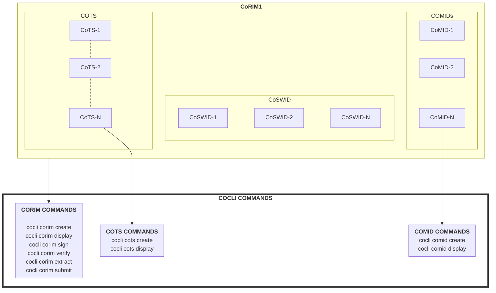

```mermaid 
flowchart TD
  subgraph COCLI["<b>COCLI COMMANDS</b>"]
    style COCLI fill:#ffffff, stroke:#333,stroke-width:4px
    subgraph COMIDCMD["<b>COMID COMMANDS</b> \n cocli comid create \n cocli comid display"]
    end
    subgraph COTSCMD["<b>COTS COMMANDS</b> \n cocli cots create \n cocli cots display"]
    end
    subgraph CORIMCMD["<b>CORIM COMMANDS</b> \n
        cocli corim create \n cocli corim display \n cocli corim sign \n cocli corim verify\n cocli corim extract\n cocli corim submit"]
    end
  end
 CORIM ---> CORIMCMD
subgraph CORIM["<b>CoRIM1</b>"]
      subgraph CoMID["COMIDs\n"]
        CM1["CoMID-1"]
        CM2["CoMID-2"]
        CM3["CoMID-N"]
        CM1  -.- CM2
        CM2  -.- CM3
        CM3 --> COMIDCMD
     end
     
    subgraph CoSWID["CoSWID\n"]
        CSW1["CoSWID-1"]
        CSW2["CoSWID-2"]
        CSW3["CoSWID-N"]
        CSW1  -.- CSW2
        CSW2 -.- CSW3
    end

    subgraph CoTS["COTS\n"]
        CS3["CoTS-N"]
        CS2["CoTS-2"]
        CS1["CoTS-1"]
        CS1  -.- CS2
        CS2  -.- CS3
        CS3 ---> COTSCMD
    end

end
 
```
